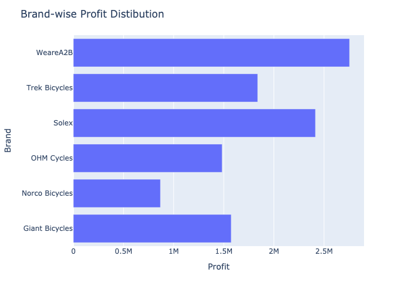
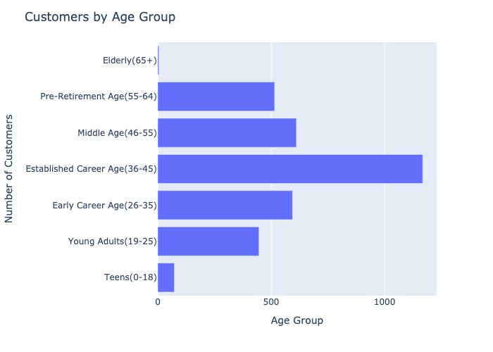
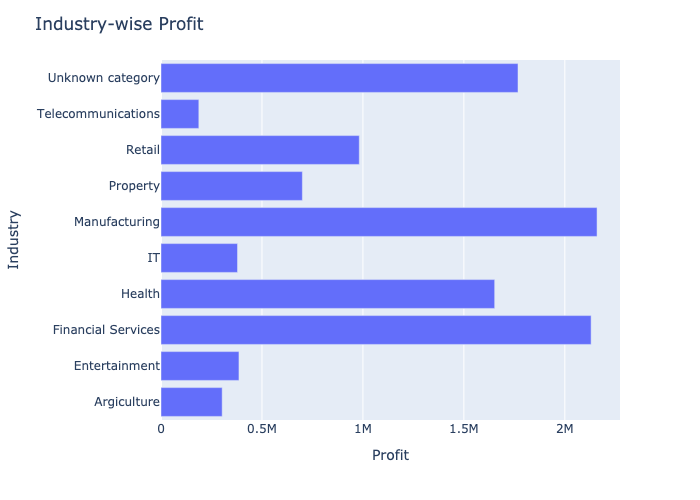

# Customer Segmentation Analysis for Australian Bike Company

## Overview

This project involves a comprehensive Customer Segmentation Analysis for an Australian bike company. By using the given dataset and applying advanced analytical techniques, the goal of the project is to uncover valuable insights about customer behavior and segment performance. The analysis uses RFM (Recency, Frequency, Monetary) model to categorize customers and visualize key metrics, aiming to enhance sales strategies and customer engagement. Along with RFM analysis, a detailed analysis is performed on state wise customer distribution, profits made from different age groups, industrial sectors, customer segments, and brands. The recency and frequency of customers is analyzed against monetary benefits to the company.

## About RFM Analysis
RFM Analysis (Recency, Frequency, Monetary) is a technique used to evaluate and segment customers based on their purchasing behavior. This approach helps businesses understand customer value and tailor marketing strategies accordingly.

- Recency (R): Measures how recently a customer has made a purchase. Customers who purchased more recently are considered more engaged.
- Frequency (F): Measures how often a customer makes a purchase. Customers who make purchases more frequently are more loyal.
- Monetary (M): Measures how much money a customer spends. Customers who spend more are more valuable.
RFM Analysis Process:

### Data Preparation: 
1. Aggregate and clean transaction data.
2. Scoring: Assign scores for Recency, Frequency, and Monetary values.
3. Segmentation: Classify customers into segments such as 'Champions', 'At Risk', 'Lost Customers', etc., based on their RFM scores.
4. Analysis: Identify trends and patterns to guide marketing strategies and improve customer retention and sales.

For detailed implementation, refer to [RFM_Analysis.ipynb](notebooks/RFM_analysis.ipynb).

## Raw Data

The raw data comprises four different sheets from an Excel file:

1. **Transactions**: Contains detailed transaction records for customers across Australian.
2. **NewCustomerList**: Contains newly acquired customers who have recently interacted with the company.
3. **CustomerDemographic**: Contains demographic information including age, gender, and occupation.
4. **CustomerAddress**: Contains address details of the customers.

## Data Cleaning and Preparation

1. **Data Cleaning**: Each dataset is cleaned and processed in separate notebooks. The cleaned data is then exported as CSV files for analysis.

2. **RFM Analysis**:
   - **Segmentation**: Customers are segmented based on their Recency, Frequency, and Monetary scores calculate from transaction data.
   - **Analysis**: Conducted Recency vs. Monetary and Frequency vs. Monetary analyses to understand customer purchasing behavior.

3. **Visualization and Analysis**:
   - **Customer Segments by State**: Analysed how different customer segments are distributed across various states.
   - **Age Group-wise Customer Distribution**: Visualized the distribution of customers across different age groups.
   - **Profit Analysis**: Analysed profit distribution by industry, customer segment, and age groups.

## Visualizations
### Meonetary vs Recency
"Champions" are the highest spenders with recent purchases, while the "Lost Customers" is the vast customer numbers. 

**Suggestive steps**:
To boost sales and customer retention, focus on improving the engagement with Champions, re-engaging with the Lost Customers, and nurture New Customers with targeted offers and loyalty programs.  

## Monetary vs Frquency
We can see here that high frequency customers spend more.

**Suggestive steps**:
Increasing the purchasing frequency using promotions and loyalty programs can significnatly boost the overall sales.

## Customer Segmentation Analysis

1. **Customer Distribution by Segments**

Highest number of customers are in "Lost Customers" and "Average Customers."

**Suggestive steps**:
- Implement retention strategies for "Lost Customers."
- Engage "Average Customers" to convert them into "Loyal Customers."

2. **Customer Segments Distribution by State**

NSW and VIC have the highest "Lost Customers."

**Suggestive steps**:
- Develop region-specific strategies to convert "Average Customers" to "Loyal Customers."
- Enhance retention initiatives in QLD.

 

## Brand-wise Profit Distribution
WeareA2B and Solex are the most profitable brands.

**Suggestive steps**: 
- Prioritize marketing campaigns for top-performing brands.
- Offer cross-brand promotions to maximize revenue.

## Agewise Customer Distribution and Profit
"Established Career Age" group is the most profitable.

**Suggestions**:
- Target marketing campaigns at "Established Career Age" and "Early Career Age" groups.
- Offer promotions and financing options to these segments.

 

## Profit by Industry
Manufacturing and Financial Services are top industries by profit.

**Suggestions**:
- Explore partnerships with top industries.
- Use industry networks to increase sales.

## Segment-wise Profit
"Average Customers" and "Lost Customers" contribute significantly to profit.

**Suggestive steps**:
- Focus marketing efforts on "New Customers" and "Potential Loyalists."
- Introduce loyalty programs to imporve profitability.

    

## Files and Structure

- **Data Files**:

  Raw Data:   
  [Raw_data.xlsx](notebooks/Raw_data.xlsx)
  
  Cleaned data:   
    [transaction_data_cleaned.csv](notebooks/transaction_data_cleaned.csv)  
    [new_customer_cleaned.csv](notebooks/new_customer_cleaned.csv)  
    [customer_demography_cleaned.csv](notebooks/customer_demography_cleaned.csv)  
    [customer_address_cleaned.csv](notebooks/customer_address_cleaned.csv)  
    [rfm_data.csv](notebooks/rfm_data.csv)

- **Analysis Notebooks**:  
  Data cleaning for each sheet:  
    [transaction_data_cleaning.ipynb](notebooks/transaction_data_cleaning.ipynb)  
    [new_customer_cleaning.ipynb](notebooks/new_customer_cleaning.ipynb)  
    [customer_demography_cleaning.ipynb](notebooks/customer_demography_cleaning.ipynb)  
    [customer_address_cleaning.ipynb](notebooks/customer_address_cleaning.ipynb)  

  For RFM analysis and customer segmentation:   
  [RFM_Analysis.ipynb](notebooks/RFM_analysis.ipynb)

  For complete data analysis and visualization:   
    [combined_data_analysis.ipynb](notebooks/combined_data_analysis.ipynb)

## Tools and Libraries

- **Python Libraries**: Pandas, Plotly, Ipython
- **Jupyter Notebooks**: Used for data cleaning, analysis, and visualization.